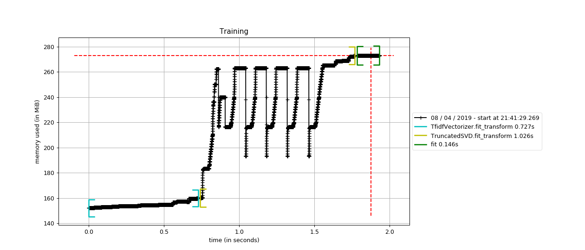
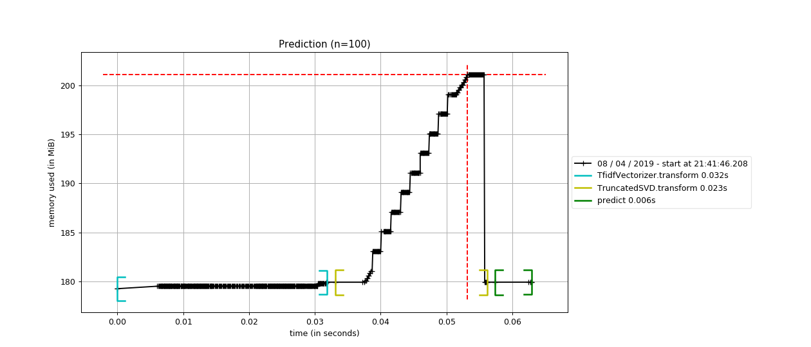
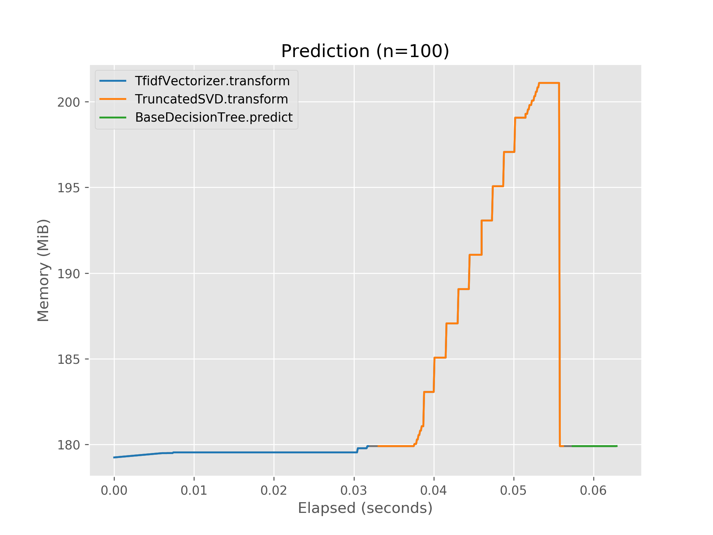

# pipeline-profiler

Add memory and wall-clock profiling to scikit-learn pipelines.

pipeline-profiler uses the time-based memory profiling of
[memory_profiler](https://pypi.org/project/memory-profiler/) to measure memory
consumption and wall-clock time of scikit-learn pipelines. It is primarily
intended for profiling machine learning models that perform batch-processing,
and/or use memory intensive run-time transformations such as image- and
text-based models. And of course for sanity checking custom
transformers/estimators.

The only required dependency is
[memory_profiler](https://pypi.org/project/memory-profiler/), but in order to do
anything useful [scikit-learn](https://scikit-learn.org/stable/index.html) and
[matplotlib](https://matplotlib.org/) should also be installed.
pipeline-profiler can be used with Python 3.5+.


## Usage

Import the `profile` context manager and call the pipeline method(s) you want to
profile from within it. The profiling results will be in written to a file in a
format that is compatible with `mprof`.

```python
from pipeline_profiler import profile

with profile(pipeline):
    y_pred = pipeline.predict(X)
```

```bash
$ mprof plot pprof_*.dat
```

Statements outside the context manager are not profiled - the pipeline can be
used as normal.


## Examples

Train a text classification model with added profiling of the training process.

```python
from sklearn.datasets import fetch_20newsgroups
from sklearn.decomposition import TruncatedSVD
from sklearn.externals import joblib
from sklearn.feature_extraction.text import TfidfVectorizer
from sklearn.pipeline import make_pipeline
from sklearn.tree import DecisionTreeClassifier

from pipeline_profiler import profile


categories = ["alt.atheism", "soc.religion.christian", "comp.graphics"]
news_groups = fetch_20newsgroups(subset="train", categories=categories)
X, y = news_groups["data"], news_groups["target"]

pipeline = make_pipeline(
    TfidfVectorizer(),
    TruncatedSVD(n_components=100),
    DecisionTreeClassifier()
)

with open("pipeline_train.dat", "w") as fh, profile(pipeline, fh):
    pipeline.fit(X, y)

joblib.dump(pipeline, "newsgroups_model.pkl")
```

Profile prediction of a batch of documents.

```python
from sklearn.datasets import fetch_20newsgroups
from sklearn.externals import joblib

from pipeline_profiler import profile


categories = ["alt.atheism", "soc.religion.christian", "comp.graphics"]
news_groups = fetch_20newsgroups(subset="train", categories=categories)
X = news_groups["data"][:100]

pipeline = joblib.load("newsgroups_model.pkl")

with open("pipeline_predict.dat", "w") as fh, profile(pipeline, fh):
    y_pred = pipeline.predict(X)
```

Use `mprof` to plot the results.

```bash
$ mprof plot pipeline_train.dat --title="Training"
$ mprof plot pipeline_predict.dat --title="Prediction (n=100)"
```

 

Which shows a spike in memory use during transformation routine of
`TruncatedSVD`.

For custom plotting, the profiling data can be read using `mprof`'s Python API
and plotted using [matplotlib](https://matplotlib.org/).

```python
from mprof import read_mprofile_file
import matplotlib.pyplot as plt
import numpy as np


plt.style.use("ggplot")
cmap = plt.get_cmap("tab10")

data = read_mprofile_file("pipeline_predict.dat")

fig, ax = plt.subplots(figsize=(8, 6))
mem_usage = np.asarray(data["mem_usage"])
timestamp = np.asarray(data["timestamp"])
elapsed = timestamp - np.min(timestamp)

# Add a line for the entire time-series, so there aren't gaps
# between segments.
ax.plot(elapsed, mem_usage, c="k", alpha=.5)

# Give each function its own color.
colors = {}
for i, (label, intervals) in enumerate(data["func_timestamp"].items()):
    if label not in colors:
        colors[label] = cmap(i)

    for j, (start, end, _, _) in enumerate(intervals):
        # Don't duplicate legend entries when there are multiple intervals.
        label_ = "_nolegend_" if j != 0 else label
        within_interval = (timestamp >= start) & (timestamp <= end)
        ax.plot(
            elapsed[within_interval],
            mem_usage[within_interval],
            c=colors[label],
            label=label_,
        )

ax.set_title("Prediction (n=100)")
ax.set_xlabel("Elapsed (seconds)")
ax.set_ylabel("Memory (MiB)")
ax.legend()
```


